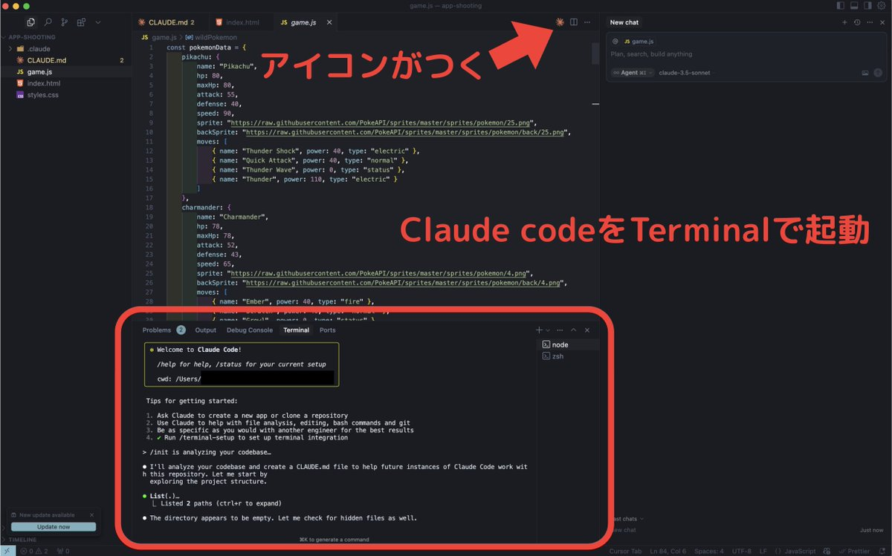
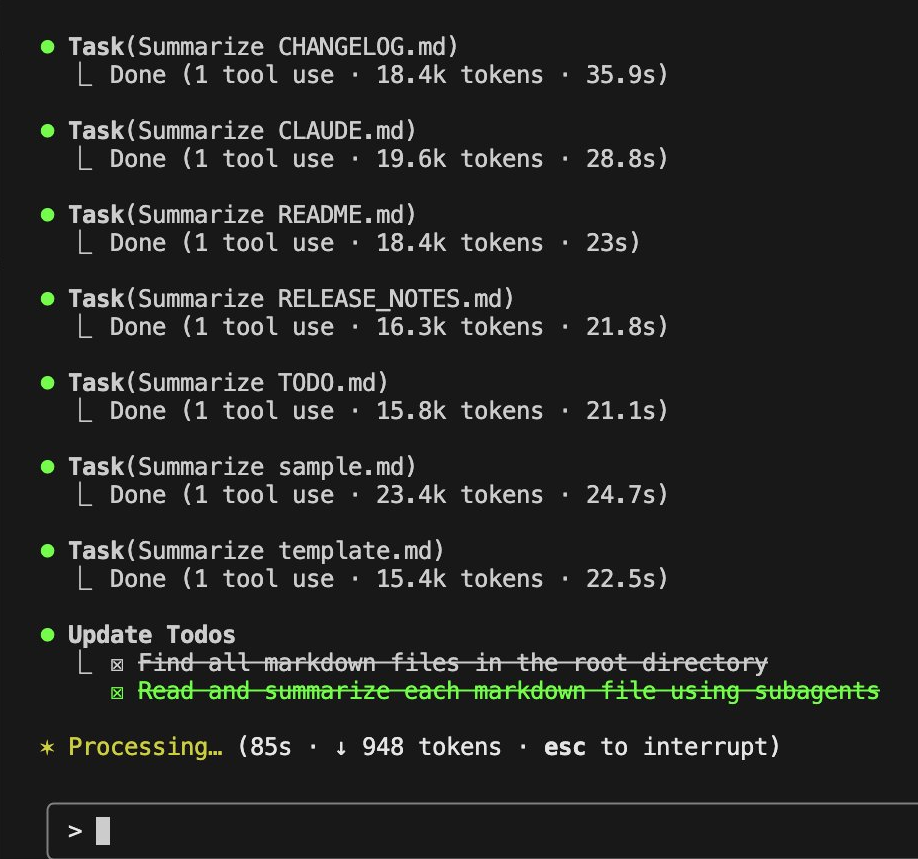
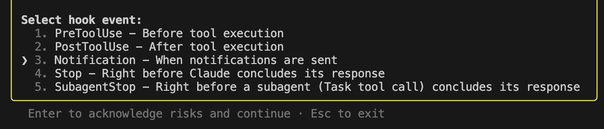

# 初学者でも今すぐできる、Claude Codeの生産性を10倍上げるTips

Oikon

2025/07/05

Claude Code 初学者 勉強会 2

## Who are you?


Oikon

外資IT企業, R&D, 開発
エンジニア歴6年
趣味でツール弄りや個人開発してます
最近はClaude Codeの発信多め（Zenn, 𝕏のハイライト）

𝕏: @gaishi_narou


## Claude Code歴

Claude Code:
- Anthropic推し
- Claude 3.5から使用（ちょうど１年くらい）
- Claude Codeは3月に初使用
- Maxプラン開放後愛用（5/1~）

主な使い方:
- ツール作成
- 趣味の開発
- OSSなどコード分析
- LTスライド作成 (new)

## 今回話すこと

### 対象: Claude Code初学者

Claude Codeを使ってみたい・使い始めた方

### 話す内容

X の "CLAUDE CODE 10x productivity workflow" のアレンジ。10分くらいで試せるTips

1. IDE(VSCode, Cursor)統合
2. Planモード (Shift + Tab 2回)
3. CLAUDE.mdのメンテナンス
4. `/clear`によるコンテキストの浄化
5. `Think`の拡張
6. `permissions`の設定
7. 最新知識・ドキュメントのInput
8. Task (subagent) の活用
9. +α: Hooksの活用


## 1: IDE（VSCode, Cursor）統合

Claude Codeユーザーの多くはIDE統合して使用
CLIツールが苦手な人におすすめ

メリット:

- 変更履歴が見やすい
- 慣れているエディタが使える
- Cursor, GitHub copilotとの併用

Claude CodeはCLIツールとしても活用できるが、
まずはIDEで試すのがおすすめ
個人的には動作が軽いVSCodeを使用している



## 2: Plan モード (Shift + Tab 2 回)

Claude Codeのタスク実行前にプラン立ててくれる

メリット:

- いきなり走り始めない
- 必要であればプラン修正可能

ワンショットのプロンプトエンジニアリングは手戻りも多い
コンテキストを大事にする観点でも、Planモードを実行推奨

（余談）settings.json で起動時のデフォルトを Plan モードにできる

```json
{
    "permissions": {
        "defaltMode": "plan" // "acceptEdits" | "bypassPermissions"
    }
}
```

## 3: CLAUDE.md のメンテナンス

CLAUDE.md(CLAUDE.local.md)は、Claude Code起動時に読み込まれるドキュメント
Claude Code の守って欲しいルールを記載する（強制力はないので注意）

ポイント:

- プロジェクトの構造・機能を記載
- 定期的に更新する（`/init`でも可能）
- `#`で適宜新規の指示を追加

CLAUDE.mdは定期的にメンテナンスすることを推奨。
Anthropic公式のGitHubリポジトリやawesome-claude-codeのCLAUDE.mdを参考にすると良い。

(ref)
<https://github.com/anthropics>
<https://github.com/hesreallyhim/awesome-claude-code>

## 4: `/clear`によるコンテキストの浄化

Claude Code が期待通りの動作をするためには、**コンテキストウィンドウ**（作業メモリ, 200K）をいかに大事にするかが重要。

意識すること:

- 余計なコンテキストは入れない
- 具体的な指示。余計なファイルを読ませない
- 関係のないタスクは、別のセッションで行う(`/clear`する)

タスクが終了したら定期的に`/clear`をして、コンテキストウィンドウをクリーンにする

（個人的には`/compact`をあまり信用していない。必要ならClaudeにドキュメントに起こしてもらう方がいい）

## 5: `Think`の拡張

Claude Code には思考トークン予算（Thinking Token Budget）が存在する

| Language | 31999 tokens              | 10,000 tokens          | 4000 tokens   |
| :------- | :----------------------- | :-------------------- | :----- |
| English  | **ultrathink**, think harder | **megathink**, think hard | **think**  |
| 日本語   | 深く考えて               | よく考えて            | 考えて |

環境変数`MAX_THINKING_TOKENS`の変更可能。
常に`ultrathink`したい場合 -> 31999

settings.json (settings.local.json):

```json
{
    "env": {
        "MAX_THINKING_TOKENS": "31999" // 1024 ~ 200000
    }
}
```

(ref)
<https://docs.anthropic.com/en/docs/claude-code/settings>
<https://zenn.dev/fbbp/articles/7aa9a46518a609>
<https://zenn.dev/oikon/articles/0281640eae5aed>

## 6: `permissions`の設定

`permissions`はsettings.jsonで設定

`allow`と`deny`をそれぞれ設定できる。
`allow`はClaude Codeを使用中に逐次追加できるので、`deny`の設定をしておくことを推奨

注意：必ず守ってくれるという過信は厳禁。
`rm -fr`はすり抜ける報告もあり。

settings.json (settings.local.json):
```json
{
  "permissions": {
    "allow": [
    ],
    "deny": [
      "Bash(sudo:*)",
      "Bash(rm:*)",
      "Bash(rm -rf:*)",
      "Bash(git push:*)",
      "Bash(git commit:*)",
      "Bash(git reset:*)",
      "Bash(git rebase:*)",
      "Read(.env.*)",
      "Read(id_rsa)",
      "Read(id_ed25519)",
      "Read(**/*token*)",
      "Read(**/*key*)",
      "Write(.env*)",
      "Write(**/secrets/**)",
      "Bash(curl:*)",
      "Bash(wget:*)",
      "Bash(nc:*)",
      "Bash(npm uninstall:*)",
      "Bash(npm remove:*)",
      "Bash(psql:*)",
      "Bash(mysql:*)",
      "Bash(mongod:*)",
      "mcp__supabase__execute_sql"
    ]
  },
}
```

[xより引用](<https://izanami.dev/post/d6f25eec-71aa-4746-8c0d-80c67a1459be>)

(ref)
<https://izanami.dev/post/d6f25eec-71aa-4746-8c0d-80c67a1459be>
<https://zenn.dev/watany/articles/df6f3b0d3af825>

## 7: 最新知識・ドキュメントのInput

Claude Codeは最新の知識を持っていないため、追加で知識を与えてあげる必要がある
(Opus/Sonnetは2025年3月までの学習)

知識を追加する方法：
1. pdf, mdなどドキュメントを直接与える
2. 最新情報をWebSearchで検索してもらう
3. MCPサーバーを活用する（Context7, Brave-Searchなど）

すぐに導入して使いやすいのは[Context7](https://github.com/upstash/context7)

Context7：代表的なライブラリから最新情報を取得してくれる

導入方法:

```sh
claude mcp add context7 -s project -- npx -y @upstash/context7-mcp
```
-s : スコープ（user, project, local）

(ref)
<https://github.com/upstash/context7>
<https://zenn.dev/karaage0703/articles/3bd2957807f311>

## 8: Task (subagent) の活用

Claude Codeの**Task**は、Subagentが実行している

- 軽量
- 並列起動可能
- subagentは独自のContext Windowを持つ
- 単独のタスクで動作し完了すると解放される
- 親agentで使用可能なツール（MCPサーバーなど）を使える

使い方：
"use (multiple) subagents ..."

簡単なタスクは積極的にSubagentに任せることがおすすめ



## +α: Hooks の活用

7月1日に追加された新機能！
Claude Codeのアクションを検知して、事前に決められた動作を、
指定のタイミングで行う機能。

導入のメリット:

- 必ず実行してくれる（=ルールを守らせる）
- コンテキストサイズの縮小
- 拡張性の向上

すぐ導入できる例：タスク完了時の通知オンを鳴らす

`/Hooks`を実行して`Notification`か`Stop`に以下のコマンドを入れる

```sh
afplay /System/Library/Sounds/Sosumi.aiff
```

shell scriptの実行もでき、拡張性がかなり高い！



(ref)
<https://zenn.dev/gotalab/articles/2fe8d7a15409c8>

## さらに使いこなすためのキーワードたち

- Slash Command
- カスタム Slash Command
- Hooks JSON Output
- MCPサーバー
- ヘッドレスモード(claude -p "prompt")
- Git Worktree
- `--dangerously-skip-permissions`
- CodeRabbit + `/pr-comments`
- 音声入力（Aqua Voice）
- 著名なエンジニアによるコンテキストの明示（t_wada, Kent Beck, Fowler...）
- ccusage

## まとめ

- Claude CodeはCLIツールゆえにできることが多い（というか多すぎる）
- 全部の機能を熟知する必要はない。まずは使える機能を試すと良い
- Pro, Maxプランなら定額なので、色々試しまくる！
- いい活用例があったら積極的に共有してください！


## おすすめ資料

- Anthropic - Claude の紹介: https://docs.anthropic.com/ja/docs/welcome
- Anthropic - Claude Code: Best practices for agentic coding: https://www.anthropic.com/engineering/claude-code-best-practices
- spiess.dev - How I Use Claude Code: https://spiess.dev/blog/how-i-use-claude-code
- Claude Code: Best Practices and Pro Tips: https://htdocs.dev/posts/claude-code-best-practices-and-pro-tips/
- ClaudeLog: https://claudelog.com/
- Claude Code を初めて使う人向けの実践ガイド: https://zenn.dev/hokuto_tech/articles/86d1edb33da61a
- Claude Code 逆引きコマンド事典: https://zenn.dev/ml_bear/articles/84e92429698177
- claude_code_deep_dive: https://www.youtube.com/live/HqXg2vfGX3c
- Claude Code にコマンド一発で MCP サーバを簡単設定: https://zenn.dev/karaage0703/articles/3bd2957807f311
- [awesome-claude-code](https://github.com/hesreallyhim/awesome-claude-code)
